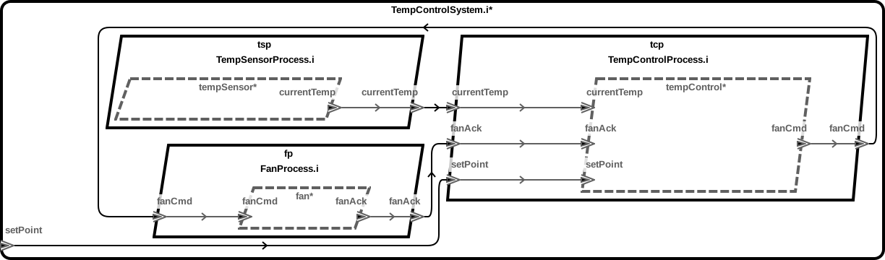

# TCCOE 2022 Tutorial - Temperature Control Sel4_Only

## Diagrams

### AADL Arch


## AADL Model Modifications for SeL4_Only

A ``Source_Text`` property should be added to each component to indicate
where its user supplied behavior code is.  For example, the
``Source_Text`` for the [TempSensor](aadl/packages/TemperatureControl.aadl#L67) points to the behavior code in 
[behavior_code/components/tempSensor.c](aadl/behavior_code/components/tempSensor.c)

If a component's initialize entrypoint should be handled then the
``Initialize_Entrypoint_Source_Text`` must be added and refer to the
method that should be invoked.  For example, the
entry for [TempControl](aadl/packages/TemperatureControl.aadl#L139) indicates the method
[temp_control_init_entrypoint](aadl/behavior_code/components/tempControl.c#L8) will be invoked during its initialization phase.

The ``Compute_Entrypoint_Source_Text`` can be added to periodic components
to indicate the method that should be invoked when the component is dispatched.  For example,
the [TempSensor's](aadl/packages/TemperatureControl.aadl#L68) entry indicates the method
[temp_sensor_compute_entrypoint](aadl/behavior_code/components/tempSensor.c#L21) will be invoked.

For sporadic components, the ``Compute_Entrypoint_Source_Text`` property can be added
to the incoming event/event-data ports to indicate the methods that will be
invoked due to the arrival of events.  For example, the entry for the Fan's 
[fanCmd](aadl/packages/TemperatureControl.aadl#L92) port indicates the method 
[handle_fanCmd](aadl/behavior_code/components/fan.c#L6) will be invoked when events arrive 
on that port.

## Build/Run Instructions

### SeL4_Only
  
  **Regenerate Code (optional)**
  ```
  ./aadl/bin/run-hamr-SeL4_Only.sh
  ```

  **How To Build/Run (via QEMU)**
  ```
  ./hamr-sel4-only/camkes/bin/run-camkes.sh -s
  ```

  **Example Output**
  ```
  Booting all finished, dropped to user space
tsp_tempSensor: Sensed 84.000000 F
tsp_tempSensor: Sensed 88.000000 F
tcp_tempControl: Received 88.000000 F
tsp_tempSensor: Sensed 92.000000 F
tcp_tempControl: Received 92.000000 F
tsp_tempSensor: Sensed 96.000000 F
tcp_tempControl: Received 96.000000 F
fp_fan: Received Off on fanCmd port
tsp_tempSensor: Sensed 100.000000 F
tcp_tempControl: Actuation worked
tcp_tempControl: Received 100.000000 F
fp_fan: Received Off on fanCmd port
tsp_tempSensor: Sensed 104.000000 F
tcp_tempControl: Actuation worked
tcp_tempControl: Received 104.000000 F
fp_fan: Received Off on fanCmd port
tsp_tempSensor: Sensed 100.000000 F
tcp_tempControl: Actuation worked
tcp_tempControl: Received 100.000000 F
fp_fan: Received Off on fanCmd port
tsp_tempSensor: Sensed 96.000000 F
tcp_tempControl: Actuation worked
tcp_tempControl: Received 96.000000 F
fp_fan: Received Off on fanCmd port
tsp_tempSensor: Sensed 92.000000 F
tcp_tempControl: Actuation worked
tcp_tempControl: Received 92.000000 F
fp_fan: Received Off on fanCmd port
tsp_tempSensor: Sensed 88.000000 F
tcp_tempControl: Actuation worked
tcp_tempControl: Received 88.000000 F
tsp_tempSensor: Sensed 84.000000 F
tcp_tempControl: Received 84.000000 F
tsp_tempSensor: Sensed 80.000000 F
tcp_tempControl: Received 80.000000 F
tsp_tempSensor: Sensed 76.000000 F
tcp_tempControl: Received 76.000000 F
tsp_tempSensor: Sensed 72.000000 F
tcp_tempControl: Received 72.000000 F
tsp_tempSensor: Sensed 68.000000 F
tcp_tempControl: Received 68.000000 F
tsp_tempSensor: Sensed 64.000000 F
tcp_tempControl: Received 64.000000 F
fp_fan: Received On on fanCmd port
tsp_tempSensor: Sensed 60.000000 F
tcp_tempControl: Actuation worked
```